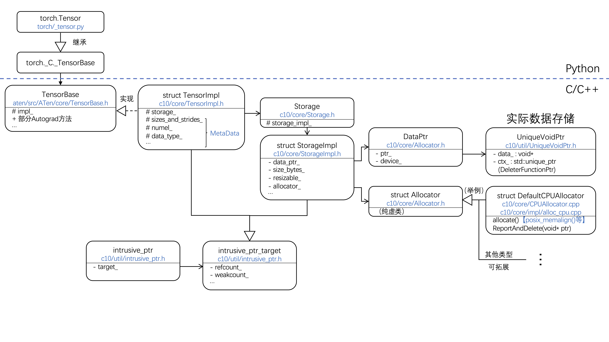

# Tensor的理论和数据结构基础

## 简要理解Tensor

Tensor，张量，原本是一个力学中的概念，在这里我们可以简单地理解为多维数组，这个多维数组的轴的数量称为阶（rank），与维度（dimension）区分；例如向量就是1阶张量，矩阵就是2阶张量。Tensor在现代机器学习中具有基础性的作用，现阶段几乎所有的机器学习底层结构均由张量运算支撑。

## Tensor的数据结构与代码实现

### 我们希望class Tensor做到什么？

**属性：**
（1）一块存储数据的内存，以及指向该内存的指针、引用计数器、内存偏移量等。不同的数据存储形式还应共享相同的接口，如PyTorch中的DataPtr类（`pytorch/c10/core/Allocator.h`和`pytorch/c10/util/UniqueVoidPtr.h`）。
（2）shape、dtype等数据解释方式。
（3）存储设备（device，由此引申，还需要不同的allocator等）、数据组织形式layout（如通常的稠密矩阵stride tensor、稀疏矩阵sparse tensor等）。
（4）自动微分（autograd，也是PyTorch Tensor与Numpy Array最具代表性的区别）。
（5）在PyTorch中，为了调用针对性优化的算法，还有DispatchKey。

**特性：**
（1）高效性：矩阵运算是机器学习算法中的底层支柱，Tensor相关代码的执行效率至关重要。例如，我们会将CPU Tensor存储在RAM（栈）中而非ROM（堆）中，PyTorch中（`pytorch/c10/core/impl/alloc_cpu.cpp`）就采用了【GCC】posix_memalign()和【MSVC】_aligned_malloc()来分配栈空间。
（2）拓展性：对于不同的硬件设备（比如CPU和CUDA），可分别实现不同的优化算法；它们应共享相同的接口，且在新设备出现时，应能进行拓展。但是，为了执行效率，我们不希望在一些非常常用的函数（如size of等）中使用虚函数，这样会严重降低执行效率。

### 在Pytorch中的实现

PyTorch版本更新比较快，这里针对[PyTorch 2.0.1 Release](https://github.com/pytorch/pytorch/releases/tag/v2.0.1)的源代码进行分析。

PyTorch 2.0.1中，Tensor相关主要class/struct结构如上图所示。Tensor在C++代码结构中主要分为4层，顶层为TensorBase，包含自动微分等函数接口；实现（implement）层为TensorImpl，储存了如size、dtype等元数据；第三层为Storage和StorageImpl，前者为后者的接口类，主要负责管理底层数据的空间分配等；最底层为一些数据分配和指针类，用于在不同的软硬件平台上实现高效的内存管理。其中，TensorImpl和StorageImpl两个结构体继承自intrusive_ptr_target类，是PyTorch自行实现的类似std::shared_ptr的智能指针，主要负责引用计数等功能。

此外，在issue([https://github.com/pytorch/pytorch/issues/14797](https://github.com/pytorch/pytorch/issues/14797))和StorageImpl.h的代码注释中，pytorch团队提到因为接口过于老旧等原因，希望废弃Storage类，但因为工程量较大，一直未能实现（该issue为2018年提出，但截至2023年仍未实现）。

例如当用户在python代码中调用`torch.Tensor()`创建张量时，通过逐层接口调用，底层的某个Allocator通过`allocate()`方法分配了一块内存（或显存）空间，由StorageImpl类进行调度，实际指针在DataPtr（UniqueVoidPtr）类中保存。

### 本项目中的实现

本项目中，将同样采取底层数据与上层应用接口分离的方案。张量库的命名空间（namespace）为t_tensor，表示tiny tensor，在定位上基本对应PyTorch中的c10和at命名空间。

#### 侵入式智能指针intrusive_ptr和intrusive_ptr_target

这部分代码位于[intrusive_ptr.hpp](../../CppSrc/CppLibraries/Tensor/intrusive_ptr.hpp)，数据结构模仿了PyTorch中的机制。

> **番外篇：关于侵入式智能指针、强引用、弱引用**
>
> 智能指针是带引用计数的指针，用来一定程度上缓解C++中令人头秃的内存泄漏问题。对强引用（如std::shared_ptr\<T\>），当一个对象被分配内存、创建时，其引用计数为1；每增加一次引用，计数就+1，反之-1，当对象引用计数为0时释放其管理的内存资源（注意，这里未必就是析构对象自身）。
>
> 但是，如果出现循环引用，比如A类中含有一个B\*，B类中含有一个A\*，那么这两个对象的强引用计数将永远大于等于1，它们的内存资源不会被自动释放，可能造成内存泄漏。因此引入弱引用计数（如std::weak_ptr\<T\>），弱引用计数独立于强引用计数，弱引用指针依赖于强引用指针。
>
> 在上述AB类循环引用环境中，让A对象中指向B的智能指针为弱引用A.weak\_ptr\_B\_，此外在主函数中还有一个指向B的强引用指针shared\_ptr\_B（如果没有这个强引用，A.weak\_ptr\_B\_无法独立存在），B对象中指向A的指针为强引用B.shared\_ptr\_A\_。这时，A和B的强引用计数均为1，弱引用计数分别为0和1。当程序运行结束时，shared\_ptr\_B引用被解除，B的强引用计数归0，B管理的内存资源被释放（但此时B的弱引用计数还为1，A.weak\_ptr\_B\_处于一个不可访问、但不是野指针问题的状态），继而A的强引用计数归0；此时A和B的强、弱引用计数均为0，所管理的内存资源，和对象本身都被析构。
>
> 简单粗暴地讲，弱指针更像是一个不允许delete的普通指针，它对它指向的对象没有所有权。智能指针不等于垃圾回收机制，不能完全避免内存泄漏问题：如循环引用问题，仍需要使用者提前预见并改用弱指针。
>
> 侵入式智能指针的“侵入”体现在，它把引用计数放在了指针所指对象object的内部，相比普通的智能指针，可以减少内存分配操作的次数，从而略微提高性能，参考资料[^1]给出了测试结果。伴随性能优化而来的缺点是，指针所指对象必须继承自intrusive_ptr_target。

intrusive_ptr_target类中最核心的成员属性ref\_count\_和weak\_count\_两个引用计数，数据类型定为std::atomic\<std\:\:size_t\>，atomic用于处理多线程。在对atomic对象进行加减法时，我们使用了C++默认的std::memory_order_seq_cst内存顺序，而非PyTorch中的std::memory_order_relaxed（weak\_count\_减法）或std::memory_order_acq_rel（其余3种情况）。一般而言，如果不知道使用哪种内存顺序，那么使用seq_cst就不会出错；这是最安全的一种顺序，但可能带来性能损失（不过在X86平台上，性能损失可忽略）。

intrusive_ptr_target类在被构造时，两个引用计数都会归零，包括默认构造、移动构造、拷贝构造的情况，因为新对象的引用计数是独立于旧对象的；在析构时，需要检查两个引用计数是否未归零（我们在析构函数中抛出了exception，这是一种不太优雅的写法）。为了节省宝贵的内存or显存资源，还提供了release_storage函数，保留target对象本身，但释放其管理的内存资源（通常用于ref\_count\_为0但weak\_count\_不为0的情况，如果weak\_count\_也为0，那么直接析构对象就可以了）。

## 参考资料

[^1]: https://zhuanlan.zhihu.com/p/460983966
